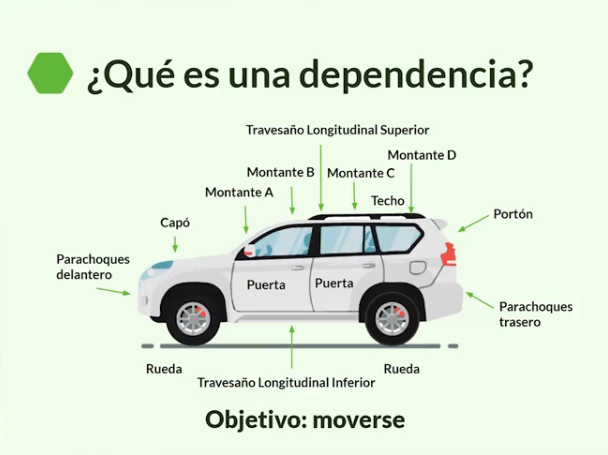
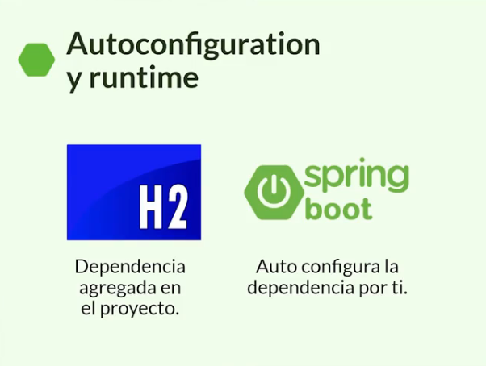

# fundamentos-spring-boot
**¿Que es Spring Boot?**
- Proyecto basado en Spring, forma parte del core al igual que Spring Cloud, etc.
- El objetivo principal es que sólo te centres en correr la aplicación sin preocuparte por temas de configuración, etc.
- Tiene la gran ventaja de poder integrar librerías de terceros de manera muy sencilla.
- No tendremos que preocuparnos por configuraciones minimas a nivel de properties (ponerle un puerto, etc).
- No tendremos que preocuparnos por desplegar nuestra aplicación en un servidor web local cuando queramos hacer pruebas, Spring Boot tambien contempla esto y lleva incorporado un servidor web dónde se desplegará nuestra aplicación automáticamente.

**Características principales de Spring Boot.**
- **Independiente:** no tenemos que preocuparnos de las dependencias del core de Spring ni de la compilación de estas.
- **Tomcat, Jetty o Undertow incrustado:** Spring Boot trae consigo un servidor web como los tres mencionados donde podemos correr nuestra aplicación sin preocuparnos de generar un artefacto WAR o JAR y desplegarlo nosotros mismos.
- **Proporción de dependencias:** no debemos preocuparnos por las configuraciones de dependencias de terceros o del core de Spring, Spring Boot se encargará de inyectar todo lo necesario 
- **Sin generación de XML:** No debemos preocuparnos de configuración XML para que nuestra aplicación funcione. 
- **Métricas de salud del aplicativo:** podemos verificar el estado de un servicio desplegado, sus dependencias estado de memoria, magnitud de configuración, etc. 

**¿Qué es una dependencia?**
- Son objetos definidos como una funcionalidad, sin la cual, los otros objetos no podrían trabajar, ya que dependen de ella. Por ejemplo, un volante es una dependencia de un vehículo, ya que sin el volante no podríamos conducirlo. 
- Sin esta funcionalidad los otros objetos no podrán trabajar, dependen de ellas. 
- Las dependencias nos permiten modularizar nuestra aplicación, lo cual nos beneficia en las pruebas unitarias.
  
- **Alta cohesión:** Involucra que la entidad ejecute acciones sin involucrar otra clase o entidad. 
- **Bajo acoplamiento:** Hablamos de acoplamiento bajo cuando existe una independencia entre los componentes entre sí, por el contrario un alto acoplamiento es cuando tenemos varias dependencias relacionadas a un solo componente.

_Entonces podemos afirmar que en la definición de un buen diseño de software se debe tener una ALTA COHESIÓN y UN BAJO ACOMPLAMIENTO._
  
**¿Qué es inversión de control?**
- Principio que transfiere el control de objetos de un programa contenedor o framework 
- A diferencia con llevar el flujo de un programa de manera tradicional 

**Ventajas de IoC**
- Desacoplamiento cuando los objetos cuentan con sus dependencias. 
- Se oculta la implementación de las dependencias, beneficio de segregación de interfaces. 
- Facilita el testing por componentes o mocks de dependencias 
- Mayor modularidad de un programa. 

**IoC en el contexto de Spring Boot**
- Los objetos que son administrados por el contenedor Spring IoC se denominan beans. 
- Un bean es un objeto instanciado, ensamblado y administrado por un contenedor Spring IoC. 

Podríamos decirlo de la siguiente forma:
_¿Qué es un bean? Un bean básicamente son módulos desarrolados en Spring, estos se encargan de brindarnos toda la lógica que necesitamos para nuestra aplicación. Ejemplo: Si necesitamos referenciar que nuestra clase es un modelo hacemos uso del bean @entity. Esto nos permite usar propiedades creadas para este tipo de módulo que nos agilizan nuestro desarrollo. Al hacer inversión de control nosotros al llamar esos beans lo que hacemos es referenciar módulos funcionales creados por spring. Spring boot nos facilita el “instanciamiento” de estos a nuestra aplicación haciéndolo por nosotros._

**¿Qué es inyección de dependencias?**
- **La inyección de dependencias (DI)** es el proceso con el que los objetos definen sus dependencias. 
- Código más limpio  y desacoplamiento más efectivo cuando cada objeto cuenta con su dependencia. 
- Implementación del principio de inversión de control. 
- Definición de los otros objetos con lo que trabajan. 
- Clases más fáciles de probar, en particular cuando son interfaces. 

**Autoconfiguration y runtime**

Configura automáticamente tus aplicaciones basadas en dependencias JAR que tú agregaste mediante el pom.xml, pero si nosotros realizamos una configuración manual esta es priorizada por Spring Boot.
_La autoconfiguración no es invasiva, siempre que queramos podemos configurar nuestros propios beans._

**¿Qué es una anotación en Spring Boot?**

Una anotación es una forma de añadir metadatos al código fuente Java que están disponibles para la aplicación en tiempo de ejecución o de compilación. Es una alternativa más sencilla al uso de XML.

**Tipos de anotaciones**
- @Controller: Para indicar que esta será la clase que gestionará las peticiones del usuario por get, post, put, patch o delete.
- @Service: Con esta notación especificamos que en esta clase se encontrará toda nuestra lógica de negocio, cálculos o llamadas a otras API externas.
- @Repository: Se usa para las clases o interfaces que funcionarán con el acceso a la base de datos, 

Si nuestra clase o interfaz no tiene una especificación clara como @Service, @Repository o @Controller, simplemente recurrimos a @Component y le indicamos que sencillamente es un componente. 

Por otro lado, no es estrictamente necesario que cumplas con colocar una notación específica, pero es una buena práctica. 

Por lo que un resumen podría ser: se hace petición HTTP desde la parte frontal a nuestra aplicación, el @Controller correspondiente recibe esa petición y llama al @Service para que este realice las validaciones correspondientes y además llame al @Respository si fuera necesario para persistir o para recuperar datos. El @Service devuelve respuesta al @Controller y éste devuelve respuesta al frontal. 

**¿Qué son los logs y cómo usarlos?**

Son una herramienta que nos permite debuggear la información, por cual método, cual clase y con qué nivel de depuración lo queremos mostrar. 

Para esto tenemos en Spring la librería Apache Commons , esta tiene los siguientes niveles de log:
- Error: Nos permite mostrar la información cuando ocurre un error.
- Info: Nos muestra información muy general
- Debug: Este nos sirve para depurar por donde está pasando la información a nivel de código fuente.
- Otros, ver documentación: Apache Commons

**Anotaciones JAVA**

JPA es una especificación API de Java que describe la gestión de datos relaciones en aplicaciones que utilizan la plataforma Java

Hibernate es una biblioteca ORM (Object Relational Mapping) que sigue la especificación JPA.

**¿Qué es JPQL?**
- JPQL es el lenguaje de consulta definido por JPA
- Similar a SQL pero con la particularidad de operar sobre objetos 

**¿Qué son los Query methods?**

Es una definición de una consulta manualmente como una cadena o derivarla del nombre del método.

**Named parameters**

Son parámetros que se envían a nivel de sentencias, estos parámetros serán inicializados dentro los parámetros del método, representándolos por medio de la anotación @Param. 
- Notación transaccional 

Al aplicar la anotación @transactional podemos presenciar al conjunto de operaciones ejecutándose de manera total, integral y atómica. Se sigue el acrónimo ACID (Atomicity, Consistency, Isolation and Durability: Atomicidad, Consistencia, Aislamiento y Durabilidad, en español).

